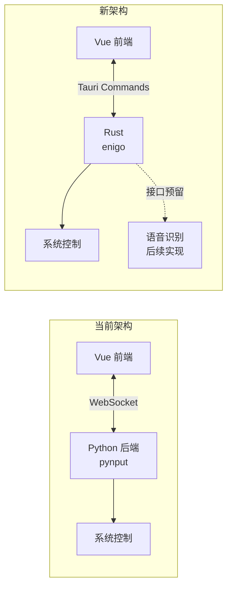

## 架构变更概述

将项目从当前的 **Vue + Python (WebSocket)** 架构迁移到 **纯 Tauri (Vue + Rust Commands)** 架构：




---

## 第一阶段：Rust 端改造

### 1.1 更新 `src-tauri/Cargo.toml`

添加鼠标键盘控制依赖 `enigo`（跨平台支持 Windows/macOS/Linux）：

```toml
[dependencies]
# ... 现有依赖 ...
enigo = "0.3"
```

### 1.2 重写 `src-tauri/src/lib.rs`

**需要移除：**

- `start_sidecar()` 函数
- `run_sidecar` command
- `tauri_plugin_shell` 的 sidecar 相关代码
- 自动启动 sidecar 的 spawn 代码

**需要添加的 Commands：**


| Command                 | 功能     | 参数                |
| ----------------------- | ------ | ----------------- |
| `move_mouse`            | 移动鼠标   | `x: i32, y: i32`  |
| `click_mouse`           | 点击鼠标左键 | 无                 |
| `scroll_up`             | 向上滚动   | 无                 |
| `scroll_down`           | 向下滚动   | 无                 |
| `send_keys`             | 发送按键   | `key_str: String` |
| `start_voice_recording` | 开始语音识别 | 无                 |
| `stop_voice_recording`  | 停止语音识别 | 无                 |


实现参考（基于 Python 原逻辑）：

- 鼠标控制：使用 `enigo::Mouse` trait
- 键盘控制：使用 `enigo::Keyboard` trait，支持组合键解析（如 `"ctrl+r"`、`"F11"`）
- 按键映射：将箭头键名称转换（`ARROWUP` → `Up` 等）

### 1.3 更新 `src-tauri/tauri.conf.json`

**移除配置：**

- `bundle.externalBin`: `["bin/backend-py/Lazyeat Backend"]`
- `bundle.resources` 中的 Python 相关资源

---

## 第二阶段：前端改造

### 2.1 重写 `src/hand_landmark/gesture_handler.ts`

**移除：**

- `TriggerAction` 类（WebSocket 实现）
- `WsDataType` enum
- WebSocket 连接和消息处理逻辑

**替换为：**

- 直接调用 Tauri Commands，使用 `invoke` 从 `@tauri-apps/api/core`

`**GestureHandler` 类保持不变**，但内部调用方式改为：

```typescript
import { invoke } from "@tauri-apps/api/core";

// 原代码：
this.triggerAction.moveMouse(screenX, screenY);

// 新代码：
await invoke("move_mouse", { x: Math.round(screenX), y: Math.round(screenY) });
```

### 2.2 删除 `src/py_api.ts`

该文件用于检测 Python 后端健康状态，新架构不再需要。

**需要检查：** 确认 `py_api.ts` 是否被其他文件引用，如有需要移除引用。

---

## 第三阶段：清理和配置

### 3.1 删除 `src-py` 目录

整个 Python 后端将被移除：

- `src-py/main.py`
- `src-py/router/ws.py`
- `src-py/VoiceController.py`

### 3.2 更新 `package.json`

**移除脚本：**

- `"build:py"`
- `"build:py-mac"`

**可选：** 移除 `requirements.txt` 相关引用

---

## 第四阶段：语音识别接口定义

### 4.1 Rust 端接口预留

在 `lib.rs` 中定义语音相关的 Commands，但暂时返回空实现或提示信息：

```rust
#[tauri::command]
async fn start_voice_recording() -> Result<String, String> {
    // TODO: 后续实现语音识别
    Ok("语音识别功能即将推出".to_string())
}

#[tauri::command]
async fn stop_voice_recording() -> Result<String, String> {
    // TODO: 后续实现语音识别
    Ok("".to_string())
}
```

### 4.2 前端保持现有调用

前端 `GestureHandler` 中的 `handleVoiceStart()` 和 `handleVoiceStop()` 继续调用语音接口，但会收到"暂未实现"的提示。

---

## 文件变更清单


| 文件路径                                   | 操作  | 说明                         |
| -------------------------------------- | --- | -------------------------- |
| `src-tauri/Cargo.toml`                 | 修改  | 添加 `enigo` 依赖              |
| `src-tauri/src/lib.rs`                 | 重写  | 移除 sidecar，添加 Commands     |
| `src-tauri/tauri.conf.json`            | 修改  | 移除 sidecar 配置              |
| `src/hand_landmark/gesture_handler.ts` | 重写  | WebSocket → Tauri Commands |
| `src/py_api.ts`                        | 删除  | 不再需要                       |
| `src-py/`                              | 删除  | 整个目录                       |
| `package.json`                         | 修改  | 移除 Python 脚本               |


---

## 注意事项

1. **跨平台兼容性**：`enigo` 支持 Windows/macOS/Linux，但某些特殊按键可能需要平台特化处理
2. **按键解析**：需要实现与 Python 版本相同的按键解析逻辑（组合键如 `ctrl+r`，功能键如 `F11`）
3. **坐标类型**：Rust `enigo` 使用 `i32` 坐标，前端发送前需要 `Math.round()` 取整
4. **异步处理**：Tauri Commands 是异步的，`GestureHandler` 中的调用需要改为 `await`

