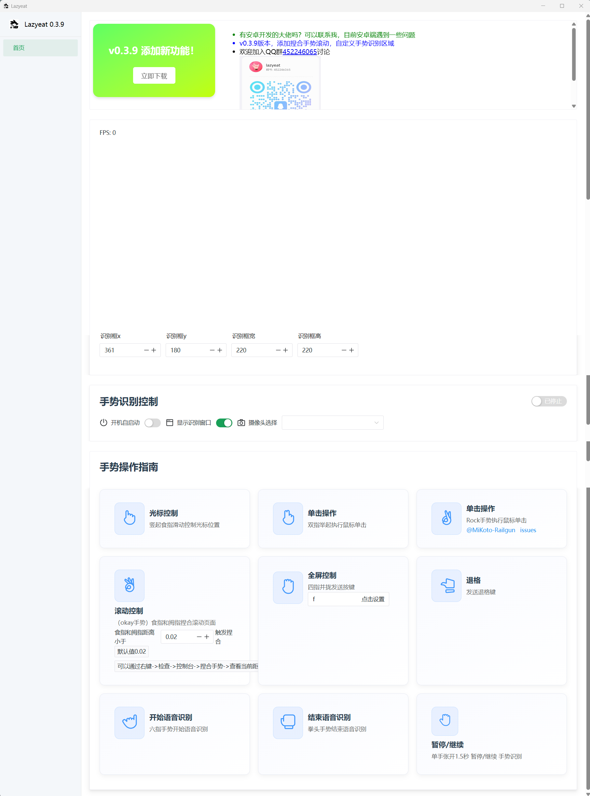

<h1 align="center">
  <a href="https://github.com/maplelost/lazy-eat/releases">
    <br>
  </a>
<div align="center">


[English README](README_EN.md)

</div>
</h1>

# 🍕 Lazyeat

Lazyeat 吃饭时看剧/刷网页不想沾油手？

对着摄像头比划手势就能暂停视频/全屏/切换视频！

如果你觉得对你有用的话，不妨给我一个 star⭐ 吧~

如果有任何的想法或者建议，都可以在 [Discussions](https://github.com/maplelost/lazyeat/discussions) 中讨论喔！

# 🌠 截图

视频演示:https://www.bilibili.com/video/BV11SXTYTEJi/?spm_id_from=333.1387.homepage.video_card.click



# 快速开始
```
# 版本号声明
\Desktop\lazyeat> python --version
Python 3.11.11

Desktop\lazyeat> rustc --version
rustc 1.85.1 (4eb161250 2025-03-15)

\Desktop\lazyeat> node --version
v22.14.0
```
1. 安装 [rust](https://www.rust-lang.org/zh-CN/tools/install)
2. 安装 [nodejs](https://nodejs.org/zh-cn/)
3. 执行下面命令

```bash
# 1. 安装 npm 以及 python 环境
npm run install-reqs

# 2. build tauri 图标
npm run build:icons

# 3. pyinstaller 打包
npm run py-build

# 4. tauri 开发模式
npm run tauri dev

# 5. tauri 生产构建
# npm run tauri build
```

如果你需要 debug 后端，那么先 pyinstaller 打包，再运行 `python src-py/main.py`。
`npm run tauri dev` 需要先生成 [tauri.conf.json](src-tauri/tauri.conf.json) 中编写的 sidecar。
详见：https://v2.tauri.app/zh-cn/develop/sidecar/

# 📢 语音识别模型下载

[小模型](https://alphacephei.com/vosk/models/vosk-model-small-cn-0.22.zip)

[大模型](https://alphacephei.com/vosk/models/vosk-model-cn-0.22.zip)

下载后解压到 `exe` 同级的 `model` 文件夹下,才能使用语音识别功能


# 📝 TODO

- [ ] (2025 年 3 月 12 日) 嵌入 browser-use ，语音控制浏览器
- [ ] (2025 年 3 月 24 日) 开发安卓版本

[//]: # "# 📚 References"

# Star History

[](https://www.star-history.com/#maplelost/lazyeat&Date)

# 开发问题

tauri build 失败:[tauri build 失败](https://github.com/tauri-apps/tauri/issues/7338)

cargo 被墙:[cargo 被墙,换源](https://www.chenreal.com/post/599)

```
# 不知道有没有用
rm -rf ~/.cargo/.package-cache
```
