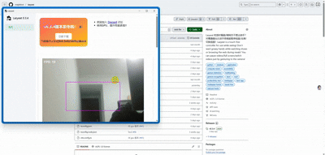

<h1 align="center">
  <a href="https://github.com/maplelost/lazy-eat/releases">
    <br>
  </a>
<div align="center">


[English README](README_EN.md)

</div>
</h1>

# 🍕 Lazyeat

Lazyeat 吃饭时看剧/刷网页不想沾油手？

对着摄像头比划手势就能暂停视频/全屏/切换视频！

如果你觉得对你有用的话，不妨给我一个 star⭐ 吧~

如果有任何的想法或者建议，都可以在 QQ 群 [452246065](https://jq.qq.com/?_wv=1027&k=452246065) 中讨论喔！

|    平台    | 支持状态  |                               下载地址                               |
| :--------: | :-------: | :------------------------------------------------------------------: |
| 🪟 Windows |  ✅ 支持  | [下载最新版本](https://github.com/maplelost/lazyeat/releases/latest) |
|   🍎 Mac   |  ✅ 支持  | [下载最新版本](https://github.com/maplelost/lazyeat/releases/latest) |
|  🐧 Linux  | ⏳ 开发中 |                                  /                                   |
| 🤖 Android | ⏳ 开发中 |                                  /                                   |
|   📱 iOS   | ⏳ 开发中 |                                  /                                   |

## 功能

- 单指滑动控制光标
- 双指/Rock 执行鼠标单击
- ok手势控制页面滚动
- 四指并拢发送按键
- 支持语音输入



# 🌠 截图

视频演示:https://www.bilibili.com/video/BV11SXTYTEJi/?spm_id_from=333.1387.homepage.video_card.click


---

# 快速开始

```
# 版本号声明，以下为我的开发环境
\Desktop\lazyeat> python --version
Python 3.11.11
(2025年4月19日 python 3.12.7 以及以上版本 pyinstaller 打包会失败)

Desktop\lazyeat> rustc --version
rustc 1.85.1 (4eb161250 2025-03-15)

\Desktop\lazyeat> node --version
v22.14.0
```

### 安装 rust 和 node

[rust](https://www.rust-lang.org/zh-CN/tools/install) 和 [node](https://nodejs.org/zh-cn/)

### 终端进入项目根目录

```bash
cd 到项目目录（也就是lazyeat的根目录, 如：C:\Users\你的用户名\Desktop\lazyeat）
（也可以直接打开文件夹后在地址栏输入cmd）
```

### 安装 npm 以及 python 环境

```bash
npm run install-reqs
```
这一步如果遇到问题可以试试用管理员方式运行cmd

### build tauri 图标

```bash
npm run build:icons
```

### pyinstaller 打包

```bash
npm run build:py
# 打包 mac 版本
# npm run build:py-mac
# 打包 linux 版本
# npm run build:py-linux
```

### 下载语音识别模型并解压到项目根目录下，重命名为model
```bash 
 https://alphacephei.com/vosk/models/vosk-model-small-cn-0.22.zip
```


### 运行 tauri dev 开发环境

```bash
npm run tauri dev
```

### 额外说明

#### 打包成生产环境（不发布就不需要）

```bash
npm run tauri build
```

打包后在 **lazyeat\src-tauri\target\release**目录下找到exe文件运行即可。

---

如果你需要 debug python 后端，那么先 pyinstaller 打包，再运行 `python src-py/main.py`。

`npm run tauri dev` 需要生成 [tauri.conf.json](src-tauri/tauri.conf.json) 中编写的 sidecar。
详见：https://v2.tauri.app/zh-cn/develop/sidecar/

# 📢 语音识别模型下载

[小模型](https://alphacephei.com/vosk/models/vosk-model-small-cn-0.22.zip)

[大模型](https://alphacephei.com/vosk/models/vosk-model-cn-0.22.zip)

前面的步骤下载的是小模型，如果要替换，下载后解压到exe同目录下的 **lazyeat/model/**


# 📝 TODO

- [ ] (2025 年 3 月 12 日) 嵌入 browser-use ，语音控制浏览器
- [ ] (2025 年 3 月 24 日) 开发安卓版本

[//]: # "# 📚 References"

# Star History

[](https://www.star-history.com/#maplelost/lazyeat&Date)

# 开发问题

tauri build 失败:[tauri build 失败](https://github.com/tauri-apps/tauri/issues/7338)

cargo 被墙:[cargo 被墙,换源](https://www.chenreal.com/post/599)

```
# 不知道有没有用
rm -rf ~/.cargo/.package-cache
```
