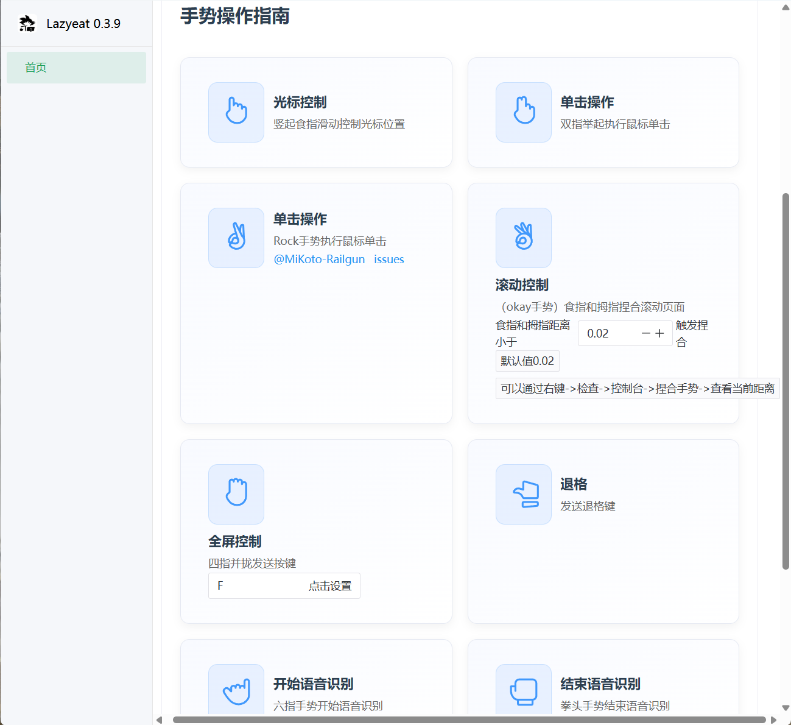

<h1 align="center">
  <a href="https://github.com/maplelost/lazy-eat/releases">
     
  </a>
</h1>

# 🍕 Lazyeat

Lazyeat 是吃饭时使用的免触碰控制器！吃饭时看剧/刷网页不想沾油手？

对着摄像头比划手势就能暂停视频/全屏/切换视频！

# 🌠 截图

# 📝 TODO

# 📚 References

# 📃 License

[LICENSE](./LICENSE)
